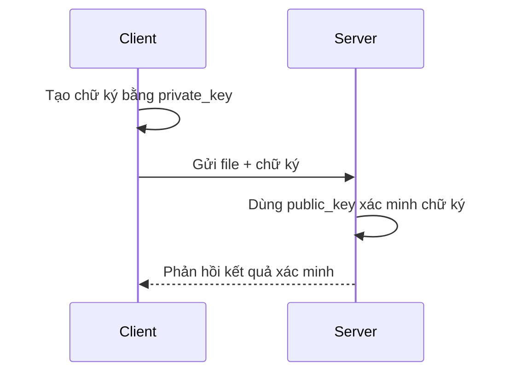

# 🔐 RSA-ATBMTT – Mô phỏng ký và xác minh chữ ký số bằng RSA

Dự án này được xây dựng để **mô phỏng quy trình ký số và xác minh chữ ký** bằng thuật toán **RSA**, phục vụ bài tập lớn môn **An toàn và Bảo mật Thông Tin (ATBMTT)**.

---

## 📌 Mục tiêu

- Tạo cặp khóa RSA (2048-bit)
- Ký số một tệp tin bằng private key
- Gửi file và chữ ký qua socket TCP (client → server)
- Xác minh chữ ký bằng public key trên server

---

## 🗂️ Cấu trúc dự án

| File/Thư mục         | Chức năng                                                                 |
|----------------------|--------------------------------------------------------------------------|
| `generate_keys.py`   | Tạo cặp khóa RSA và lưu trong thư mục `keys/`                            |
| `sign_file.py`       | Tạo chữ ký số cho file `file_to_send.txt` bằng khóa riêng                |
| `client.py`          | Gửi file + chữ ký đến server qua TCP socket                              |
| `server.py`          | Nhận dữ liệu và xác minh chữ ký bằng public key                          |
| `file_to_send.txt`   | File văn bản mẫu cần ký                                                   |
| `signature.sig`      | File chứa chữ ký số đã tạo                                               |
| `keys/`              | Chứa cặp khóa RSA: `private_key.pem` và `public_key.pem`                |
| `requirements.txt`   | Danh sách thư viện cần cài (`cryptography`, `socket`,...)                |
| `README.md`          | Tài liệu mô tả dự án                                                     |

---

## ▶️ Hướng dẫn sử dụng

### 1. Tạo môi trường ảo (khuyến nghị)

```bash
python -m venv .venv
source .venv/bin/activate     # Linux/macOS
.venv\Scripts\activate      # Windows
```

### 2. Cài đặt thư viện cần thiết

```bash
pip install -r requirements.txt
```

---

### 3. Tạo cặp khóa RSA

```bash
python generate_keys.py
```

> 📁 Kết quả sẽ tạo thư mục `keys/` chứa:
> - `private_key.pem`
> - `public_key.pem`

---

### 4. Tạo chữ ký cho file

```bash
python sign_file.py
```

> 📄 File `signature.sig` sẽ được tạo từ nội dung file `file_to_send.txt`.

---

### 5. Khởi động server (terminal 1)

```bash
python server.py
```

---

### 6. Gửi file từ client (terminal 2)

```bash
python client.py
```

---

### 7. Kết quả xác minh

Nếu chữ ký hợp lệ, server sẽ in:
```
✅ Chữ ký hợp lệ. File không bị thay đổi.
```

Nếu không hợp lệ:
```
❌ Chữ ký không hợp lệ! File có thể đã bị thay đổi.
```

---

## 📷 Minh họa hoạt động



---

## 🧠 Kiến thức áp dụng

- 🔐 Mật mã học: RSA, chữ ký số, xác thực
- 📡 Truyền thông bảo mật qua mạng TCP
- 🧪 Ứng dụng thực tế của `cryptography` trong Python

---

## 🛠️ Yêu cầu hệ thống

- Python 3.6 trở lên
- Hệ điều hành Windows / Linux / macOS

---

## 📄 License

Dự án sử dụng cho mục đích học tập. Có thể chỉnh sửa và tái sử dụng tự do.

---

## 👨‍💻 Tác giả

Ngô Tuấn Minh – Sinh viên ngành Công nghệ Thông Tin  
Trường Đại học Đại Học Đại Nam
